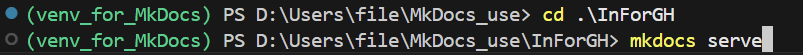
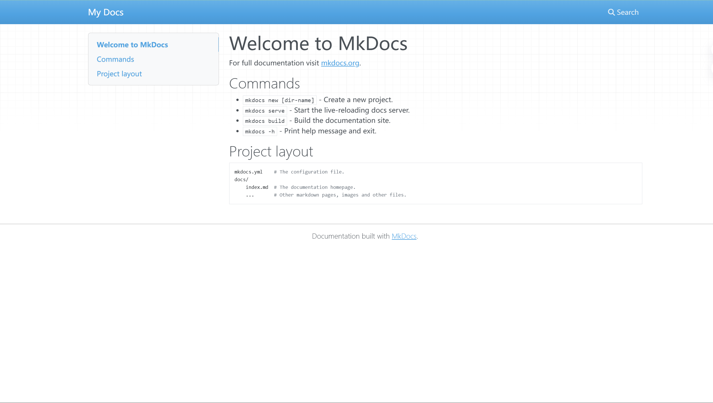
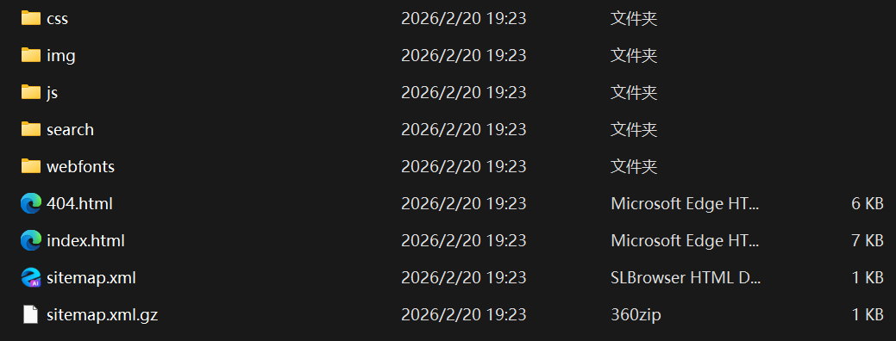

# 欢迎使用 MkDocs

这是一份面向新手的MkDocs教程，帮助你迅速写出一份 “有目录的网页”

---
## **一、启程**
---
### 开始你的第一份MkDocs项目

- 在一个你喜欢的新建文件夹中创建一个python的虚拟环境，可以命名为venv_for_MkDocs  

- 然后我们激活虚拟环境  

- 安装mkdocs库  

- 创建第一个mkdocs项目  

- 进入这个文件，并且预览它的效果（进入监视状态）  

  
正常情况下，我们使用命令：   
> mkdocs serve --livereload  
这样在监视状态下，每次编辑器中保存后网页会自动刷新
- 下面在终端按住ctrl+c解除监视，终端重新出现路径


### 恭喜你完成第一份mkdocs项目！ 
---
## **二、工作流**
---
MkDocs的工作流大致如下，非常简洁：  
### new->code->build
---
## **三、修改内容**
---
我们已经成功的完成了第一份mkdocs项目，如你所见，我们的未来将要以此为蓝本书写我们自己的内容。  
自然的会有疑问，我们该如何修改内容，下面的内容就会去说明该如何修改内容
### 1）.yml文件
对于刚使用mkdocs的用户来说，在内容编辑方面，.yml文件不会有实质的影响，可以理解为css之于html的作用，感兴趣可以在后期自行学习

### 2）.md文件  
刚生成的mkdocs项目会有一个文件夹,在这里是MkDocs_use，一般是下面这样的层级：
```
MkDocs_use  
  ->InForGH  
    ->docs  
      ->index.md   
    ->mkdocs.yml  
  ->venv_for_Mkdocs
```
在这其中找到index.md的文件打开，就会发现其中的内容和网站中几乎一模一样  
到这里基本就明朗了，网站所呈现的内容依赖index.md文件里的内容

### 3）下面我们来说一说.md的一些基本语法，方便你个性化的创作：  

- 标题  
    - `# 一级标题`  
    - `## 二级标题`  
    - `### 三级标题`

- 段落
    - 不同段落之间空一行即可  

- 分割线
    - `---`

- 换行 
    - 在上一行的末尾，两次space后换行  

- 引用  
    - `> 引用的内容`  会在内容前生成一条粗竖线并且文字自动缩进
    - `>> 嵌套引用`   会在内容前生成两条粗竖线并且文字自动缩进，可与>共同使用  

- 子项  
    - `-`,`*`或`+` 均可生成`·`状无序列表  
    - `1.`可生成有序列表

- 特殊字体
    - `*斜体*`或`_斜体_`  
    - `**粗体**`或`__粗体__`
    - `***粗斜体***`

- 代码块  
    - 其实就是保持原样输出
```  
     1. `单行代码块`
     2. ```多行代码块```  
```  

- 嵌入图片  
``  
注意这个路径要从docs文件夹开始如(photo_needed/photo1)（相对路径）  
而这个photo_needed文件夹就是docs文件夹下的一个文件夹  
- 嵌入链接  
    - [天猫](https://www.tmall.com)  
    输入 `[中文名称](https://www.tmall.com)`
    - 上述方式         是在当前页面打开链接，下面的方法可以在另一个新页面打开链接
    - 首先在.yml文件中加如下两行
```
     markdown_extensions:
       - attr_list  
```  
然后输入
`[中文名称](https://www.tmall.com){: target="_blank"}` 即可实现 


### 学会了上述内容，就可以完成基本的文档书写了！  
---
## **四、生成文件**
---
使用命令:    
> mkdocs build  

之后会在项目文件夹中生成默认名为site的文件夹,内容如下：  
  
网页主文件是index.html  
由于其他文件都以link的方式引入，所以，必须以完整site文件夹形式移动  

---
## **五、分享方式**
---
该文件只能在电脑上浏览，以文件夹（常压缩包）形式进行分享，接收方进行解压即可  
#### 然后打开index.html就可以看到网页了 
---
## **六、作者后记**  
---
本篇内容的根本目标是让新手可以迅速上手MkDocs静态站点生成器（只要电脑上有一个版本的python即可），所以对于其中不成熟的操作过程请广大读者多多包涵  
———本篇笔记来自新手作者的一次探索